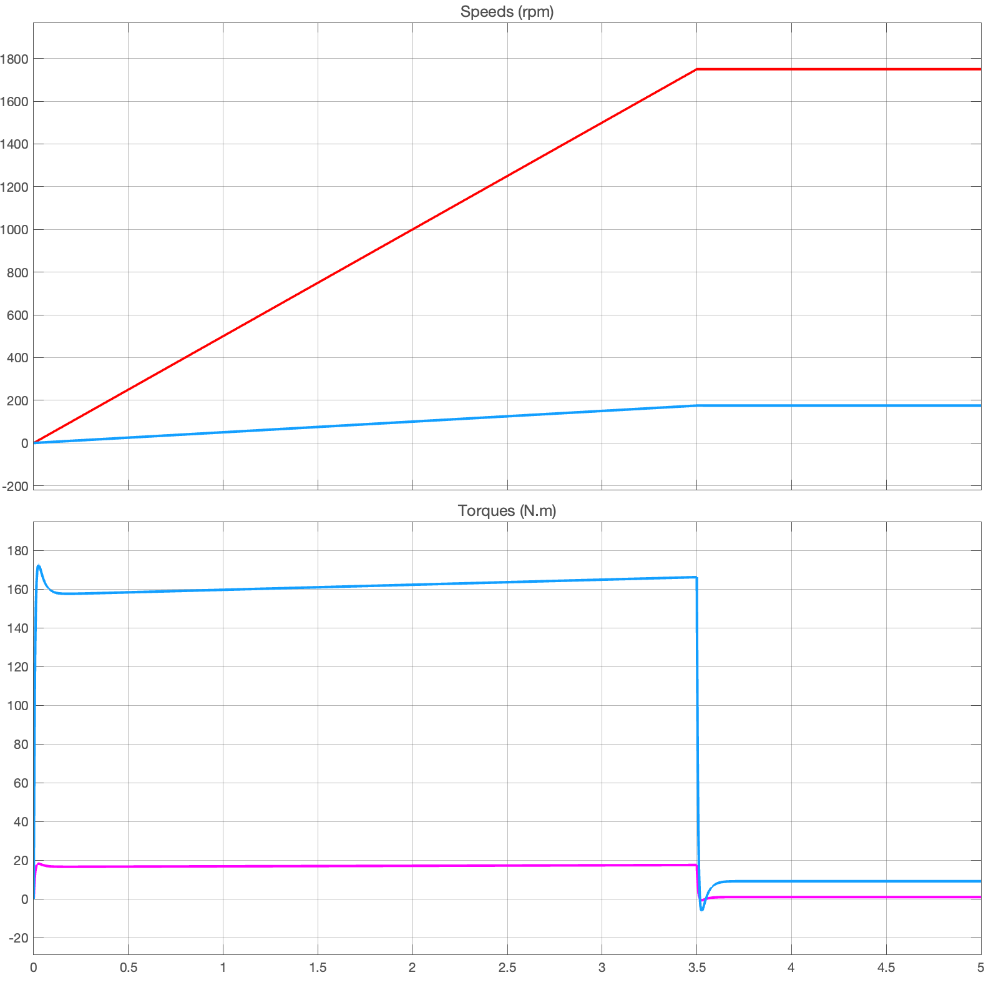
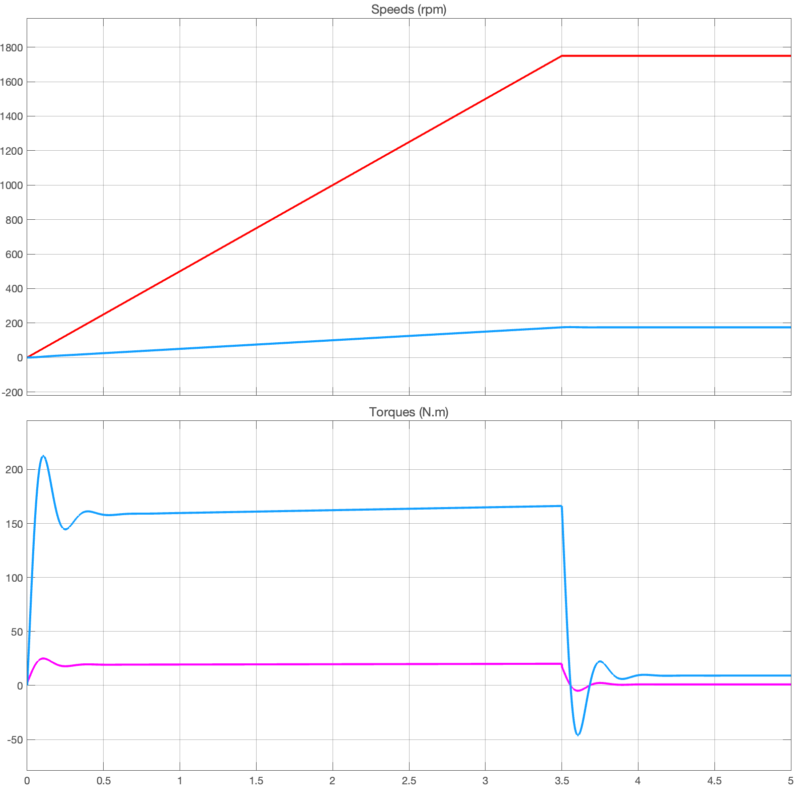
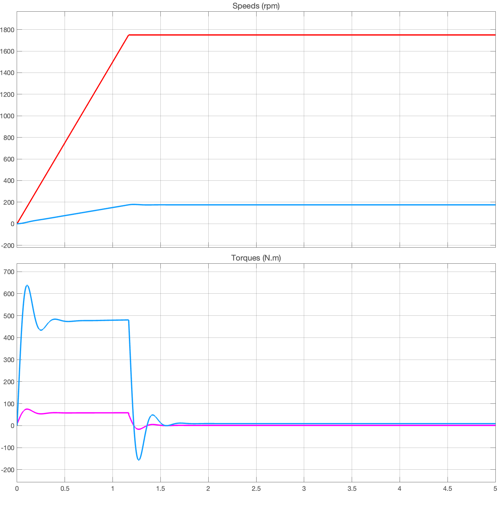

## Problem 3

### Case 1

### Case 2

With higher inertia and less stiffness and damping, the overshoot effects of the torque is much more evident for model transients when there's acceleration (change in speed).

### Case 3

With higher slew rate, the simulation was able to reach it target speed faster. This required the torque to three times as high, consistent with the increase of $3\times$ the slew rate.