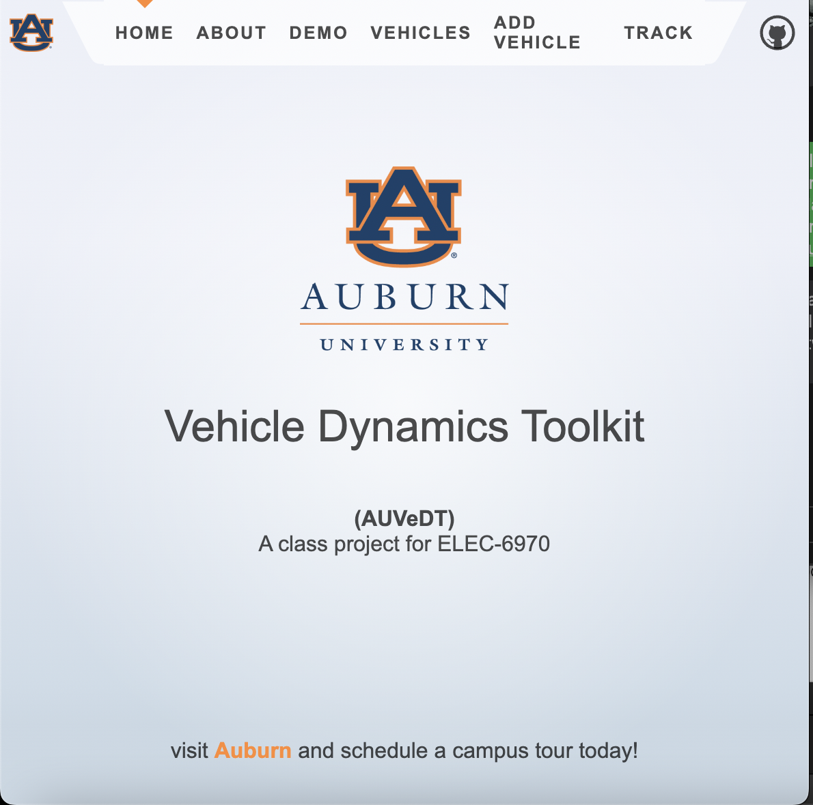
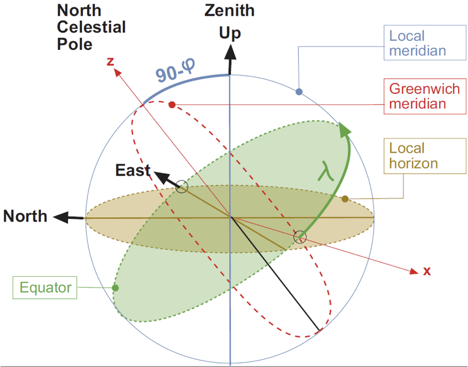

# Citizen's Modeling And Simulation Toolkit for Electric Vehicles

## Introduction

The automotive industry operates in a 20th century paradigm where intellectual property is guarded at worst and hidden by bureaucratic layers at best. Finding a dataset of technical specifications for all cars manufactured, especially focusing on electric vehicles (EV) has been difficult for researchers to accomplish. For several years now the author has attempted to model the aerodynamics of his own vehicles but no data has been available. 

Several niche auto enthusiast websites, mainly dedicated to EV and hybrid modification such as ecomodder.org has published a  list of a few vehicles. Wikipedia contributors has also added a decent list of vehicle drag coefficients that were found mentioned on various auto blogs, etc. The attempt for this semester's project was to create a dataset of as many hard-to-find technical specifications as possible and utilize in some real world M&S scenarios. With the assistance of undergraduate intern, Chandler Passions, this goal was accomplished. A list of over 300 vehicles were collected. These lists are now available on Github.com in CSV format. The lists are still being refined and curated. The requirements for collecting data would be strict, complying with rigorous academic standards. Storing the data would require understanding relational databases. 

Through this project the AUVeDT project was born. Auburn Vehicle Dynamics Toolkit aims to be a website with a web interface for those wishing to browse documentation, as well as an application programming interface (API) to allow researchers to query vehicle specifications directly from scientific programming languages such as MATLAB, Julia, R, and Python.



## Vehicle Kinematics

### Creating a Database of Vehicle Technical Specifications


### Visualizing Specifications

To view various the specifications for $C_d$, $C_{dA}$, curb weight ($m$, kg), gross vehicle weight (kg), power (kW), torque (N-m), for all the vehicles, a special view was created in the Svelte software framework that iterates over all database rows and presents them in a table (see Fig. X). At the moment, the view filters only Electric and Hybrid vehicles since they are of interest. In the future, a multi-page and filter option will be added to filter by specification, type, source, etc. Sources were hidden as well to create a cleaner view. Another feature for a future release of this web application would be to allow a researcher to click on a vehicle, see a picture of it, and list all its statistics in a page view.

### Updating Specifications

A page was created containing a form for submitting new cars or editing existing cars data. This will allow for user contributed data that will hopefully grow the website database. While our selection of vehicles are limited at the moment, at one time Wikipedia only contained one article and now contains 6,581,393 articles! Networking with faculty and business partners within the automotive industry will hopefully garner interest in creating community driven data creation and moderation.

## Recording Drive Data

### Epirical Approach to Modeling and Simulation

Instead of synthesizing data for drives, we used MATLAB Mobile to collect GPS data of typical daily commutes to and from work, similar to the standard federal datasets. This allowed us to see the nuances in a personalized paradigm for modeling and simulation where a user can visualize what his drive is like instead the average commuter in the average city. Live experimentation also helps identify edge cases in modeling where a scenario could not be conceived of in synthesized data in a computer model.

To allow users using this toolkit to collect their own drive data, the web app includes a tracking page where you can click the "track" button. If the user has not given permission to their browser to access their GPS location, they will be prompted to allow. On iOS, the user should also allow for "precise location". All data is collected on the user's device for analysis and never uploaded to a server. A future implementation may feature this option. This would also allow broader scale analysis of all the collected drive tracks.

The initial approach for modeling drive data was to collect the latitude, longitude, and altitude of the vehicle at 1Hz (roughly every 25-30 meter at highway speeds). This data would then undergo a coordinate transformations from the geodetic WGS84 model of the earth to ECEF.

### Unit and Coordinate Transformation
#### WGS84 to ECEF

Typical GPS units are geodetic and given as longitude, latitude, and altitude. This is analogous to a spherical coordinate system where longitude, latitude are typically given in degrees and altitude is similar to the $\vec{r}$ from the origin. However, the WGS84 models an ellipsoid that closely matches the shape of the earth's sphere which of course is not perfectly spherical. To convert from WGS84, the following coordinate transformations are necessary, 
$$
\begin{bmatrix}
           x \\
           y \\
           z 
         \end{bmatrix} = \begin{bmatrix}
         N(\phi) + h \ \ cos(\phi)cos(\lambda) \\
         N(\phi) + h \ \ cos(\phi)sin(\lambda) \\
         (1-e^{2})N(\phi) + h \ sin(\phi)
         \end{bmatrix}
$$
where $N(\phi)$ describes the ellipsoid's 

The Earth Centered, Earth Fixed (ECEF) coordinate frame is similar to the normal cartesian plane. Its origin is at the center of the earth and the z-axis intersects the earth's North Pole. Once coordinates are converted into an ECEF coordinate frame, they are easier to work with in determining the vehicle's speed.
$$
\text{speed} = \frac{d}{dt} \left\Vert \begin{bmatrix} \vec{x} \\ \vec{y} \\ \vec{z} \end{bmatrix} \right\Vert
$$
Unfortunately due to the high error rate in the position vectors $\begin{bmatrix}\vec{x}\\ \vec{y} \\ \vec{z} \end{bmatrix}$ the speed proved to be highly inaccurate as shown in the results section. 

#### Tangential Plane 

The tangential plane, typically known as North-East-Down (NED) or East North Up (ENU) is typically what Hussain's text uses due to its  ease of use in calculating grade, etc. To convert from ECEF to ENU, the following equation is used:
$$
\begin{bmatrix} \mathbf{x} \\ \mathbf{y} \\ \mathbf{z} \end{bmatrix} = \mathbf{R}_3[-(\pi/2 + \lambda)]\mathbf{R}_1[-(\pi/2 - \phi)]\begin{bmatrix} E \\ N \\ U\end{bmatrix}
$$
where, $\mathbf{R}_1$ and $\mathbf{R}_3$ are transformation matrices (see 5). Practically this yields the resulting,
$$
\begin{align} 
\hat{\mathbf{e}} &= (-\text{sin}(\lambda),\ cos(\lambda),\ 0) \\
\hat{\mathbf{n}} &= -\text{cos}(\lambda)\text{sin}(\phi), −\text{sin}(\lambda)\text{sin}(\phi),cos(\phi)) \\
\hat{\mathbf{u}} &= \text{cos}(\lambda)\text{cos}(\phi), \text{sin}(\lambda)\text{cos}(\phi),sin(\phi)) \\
\end{align}
$$
These coordinates can then be used as a vector of all datapoints to calculate tangential slope, percent grade and the resulting forces the electric vehicle experiences and has to overcome via its electric motor.



## Results


### Conclusion


## References

1. I. Husain, *Electric and hybrid vehicles: Design fundamentals*. Boca Raton etc.: CRC, 2021. 
2. PROJ contributors (2020). PROJ coordinate transformation software library. Open Source Geospatial Foundation. URL https://proj.org/. DOI: 10.5281/zenodo.5884394
3. S. Lakowske, *ecef-projector*., https://github.com/lakowske/ecef-projector, 2022
4. “Size of wikipedia,” *Wikipedia*, 20-Nov-2022. [Online]. Available: https://en.wikipedia.org/wiki/Wikipedia:Size_of_Wikipedia. [Accessed: 29-Nov-2022]. 
5. J. Sanz Subirana, J. M. Juan Zornoza, and M. Hernández-Pajares, *Transformations between ECEF and ENU coordinates*, 2011. [Online]. Available: https://gssc.esa.int/navipedia/index.php/Transformations_between_ECEF_and_ENU_coordinates. [Accessed: 30-Nov-2022]. 
6. J. Sanz Subirana, J. M. Juan Zornoza, and M. Hernández-Pajares, *Ellipsoidal and Cartesian Coordinates Conversion
*, 2011. [Online]. Available: https://gssc.esa.int/navipedia/index.php/Ellipsoidal_and_Cartesian_Coordinates_Conversion [Accessed: 30-Nov-2022]. 

```

@Manual{,
  title = {{PROJ} coordinate transformation software library},
  author = {{PROJ contributors}},
  organization = {Open Source Geospatial Foundation},
  year = {2022},
  url = {https://proj.org/},
  doi = {10.5281/zenodo.5884394},
}

```